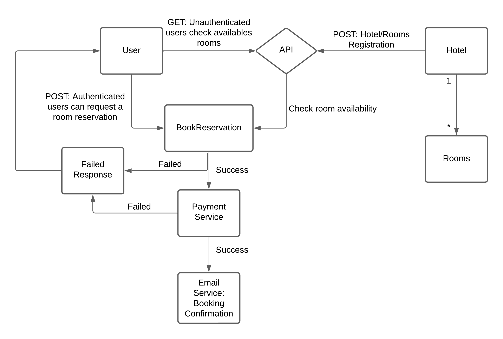
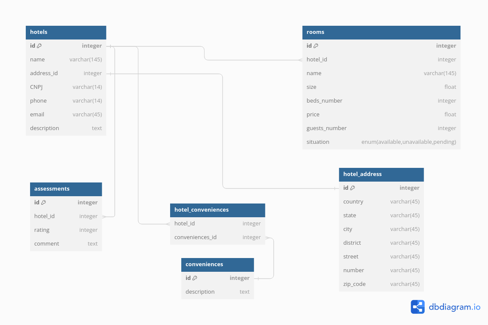

# Hotel Reservation System

**Overview:**

This project entails the development of a robust hotel reservation system REST API leveraging Java and Spring Boot.

## Big Design Up Front (BDUF)

## Hotels - Rooms UML Diagram Relationship (Initial Modeling)

## Use Cases:

### Users:

- Unautenticated users can request hotels and the respective available rooms details;
- Authenticated users can request a room reservation;
- Authenticated users can update their own installation;
- Authenticated users can delete their own account;
- Authenticated users can request a summary tour guide for the city of the hotel you intend to stay in;

### Hotel:

- Companies can register a Hotel and respectives rooms;
- Authenticated Hotel management can add new rooms;
- Authenticated Hotel management can update hotel information and rooms information;
- Authenticated Hotel management can remove rooms;
- Authenticated Hotel management can delete their own hotel;
- Hotel management can request statistics of number of monthly reservations from the city itself;

### BookReservation:

- Check the availability of requested rooms from a user;

### Payment Service:

- Check the payment process;

### Email Service:

- Return a confirmation and overview of success room reservation;
